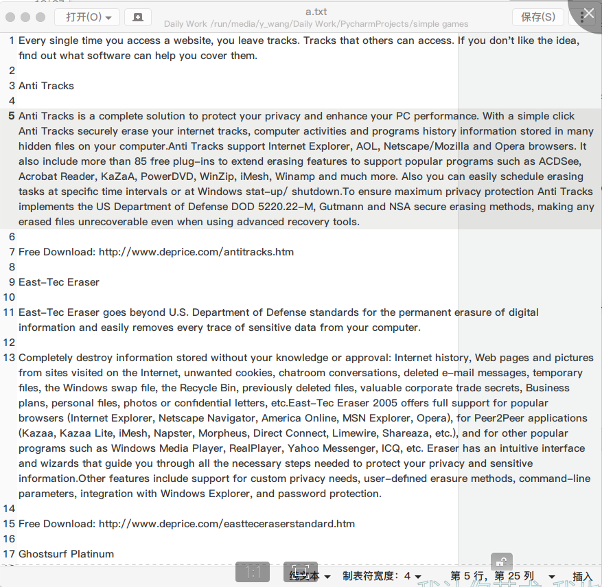
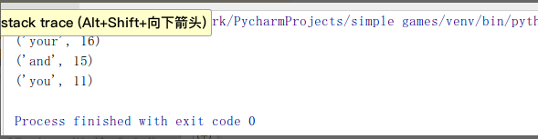

# 利用python进行词频统计

### 问题描述

现在大学生的英语水平都还不够高，想提升英语水平就需要背单词，但是单词这么多背哪个好呢，我们就需要一个程序来告诉我们背哪些更有效率。
### 任务指标

给定一些txt文件，统计里面出现单词的次数，给出一张表来让我们背单词。
### 分析与代码设计

1. 可以使用python的with open来打开并自动决定什么时候关闭这个读入程序，在文件长度不算太长的情况下，一次性将所有内容全部读入即可。
    ```
    with open('a.txt', 'r') as f:
        str = f.read()
    ```

2. 此外，因为文章中总会有各种各样的标点符号，这不利于进行统计单词，因此将所有的标点符号全部转换成空格然后使用字符串分割的split函数即可。
    ```
    str = str.replace(",", " ")
    str = str.replace(".", " ")
    str = str.replace("!", " ")
    str = str.replace("?", " ")
    str = str.replace(":", " ")
    str = str.replace(";", " ")
    str = str.replace("\'", " ")
    str = str.replace("/", " ")
    ```
3. 然后我们可以使用字典来存储，每个单词都作为key，出现的次数作为value，每次遇到相同的单词进行增加1就可以。
    ```
    str_dict = {}
    for i in str_list:
        if i in str_dict.keys():
            str_dict[i] = int(str_dict[i]) + 1
        else:
            str_dict[i] = 1
    ```
    这里还遇到了一个问题，对于增加次数的那里，如果不进行类型转换为int会出现错误提示，所以进行了类型转换。
4. 最后，对字典进行排序，然后对排序好的列表用pop函数弹出最大的几个单词就好啦。
    ```
    result = sorted(str_dict.items(), key=lambda e:e[1])
    print(result.pop())
    print(result.pop())
    print(result.pop())
    ```
### 实例文章


### 效果演示

